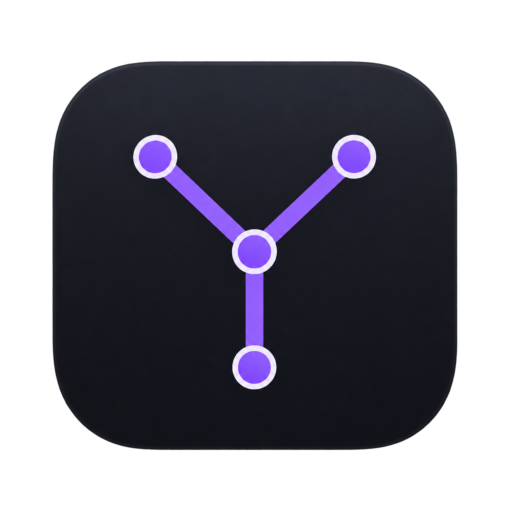

<p align="center">
  
</p>

<h1 align="center">yalt</h1>

<p align="center"><strong>Yet Another Labeling Tool</strong></p>

<p align="center">
  A lightweight, fully local macOS app for building computer-vision datasets.
</p>

<p align="center">
  <a href="https://github.com/ArgoHA/yalt/actions/workflows/ci.yml"></a>
  <a href="LICENSE"></a>
  
</p>

yalt handles object detection, instance segmentation, and image classification without a server, an account, or an upload step. Images never leave your Mac. Annotations autosave to a local SQLite database, and exchange files are only written when you explicitly import or export them.

## Features

| Task | Annotation workflow | Import and export |
| --- | --- | --- |
| Object detection | Create, resize, move, relabel, hide, and delete bounding boxes | YOLO TXT + `labels.txt`; COCO JSON bounding boxes |
| Instance segmentation | Draw and edit polygons, including disconnected islands belonging to one instance | YOLO polygon TXT + `labels.txt`; COCO JSON polygon arrays |
| Image classification | Single-label classify-and-advance or multi-label assignment | Quoted CSV; one-folder-per-class datasets |

- Fully local: no cloud service, account, analytics, or upload path.
- Native macOS desktop app with a compact, Retina-aware canvas.
- Project-local autosave after every completed edit and polygon vertex.
- Draft and workspace recovery after relaunch.
- Undo and redo for annotations, classifications, and recoverable image moves.
- Recursive JPEG, PNG, WebP, and TIFF indexing without copying source images.
- Trackpad pan, pointer-centered pinch zoom, and customizable tool shortcuts.

HEIC is not supported yet.

## Install

yalt 0.1.0 targets Apple Silicon Macs running macOS 12 or later. Download the
DMG from [GitHub Releases](https://github.com/ArgoHA/yalt/releases) and drag
yalt into Applications.

Homebrew installation is not available yet. It will be added after the first
signed and notarized GitHub release has been verified.

### Build from source

Requirements:

- Node.js 22 or later;
- Rust 1.77.2 or later;
- Xcode command-line tools.

```sh
npm install
npm run tauri dev
```

Run the frontend build, web tests, and Rust tests:

```sh
npm run check
```

Build an Apple Silicon app and DMG locally:

```sh
npm run tauri -- build --target aarch64-apple-darwin
```

Local bundles are unsigned unless Apple signing credentials are configured.

## Using yalt

1. Choose **New project** and select or drop a folder of images from Finder.
2. Pick one task. A project keeps that task for its lifetime.
3. Add classes manually or load a `labels.txt` file.
4. Annotate with the canvas, class list, or keyboard shortcuts.
5. Open the project menu (`•••`) to import or export YOLO, COCO, CSV, or class
   directories.

For detection, press and drag to draw a box. A click without a meaningful drag
creates nothing and clears the selection. The selected box shows eight resize
handles; hovering another box reveals its handles. Drag the separate handle
above a box to move it. Hold Command while dragging to create a new overlapping
box through an existing annotation.

For polygons, click the first vertex or press Return to close the contour.
Select an object and use **Add island** to add a disconnected contour to the
same instance. COCO preserves that relationship. Plain YOLO TXT cannot, so
each island is exported and imported as a separate row.

For single-label classification, assigning a class moves the source image into
that class directory and advances to the next image. The move is journaled and
undoable. Multi-label classification never moves source images.

## Keyboard shortcuts

Shortcuts work when a text field is not active.

| Shortcut | Action |
| --- | --- |
| `1`–`9`, then `0` | Select a class; in classification, apply or toggle that label |
| `←` / `→` | Previous / next image |
| `[` / `]` | Previous / next class |
| `E` | Edit existing boxes or polygons |
| `R` | Draw a rectangle in a detection project |
| `⌘` + drag | Force a new box through an existing box |
| `P` | Draw a polygon in a segmentation project |
| `I` | Add an island to the selected polygon instance |
| `Return` | Finish the polygon being drawn |
| `Backspace` / `Delete` | Remove the last draft vertex, selected object, or last remaining object |
| `Escape` | Cancel the draft or clear the current selection |
| `D D` | Move an object-free image to `deleted/` |
| `Space` + drag | Pan the canvas |
| Two-finger scroll | Pan the canvas |
| Pinch | Zoom around the pointer |
| `⌘+` / `⌘−` | Zoom in / out |
| `F` | Fit the image in the canvas |
| `⌘Z` / `⇧⌘Z` | Undo / redo |

The `E`, `R`, `P`, `I`, `F`, `[` and `]` bindings can be customized from the
project menu. Number keys and `D` remain reserved.

Backspace and Delete never remove an image. They delete the selected object,
then continue from the last remaining object. Once an image has no objects,
press `D` twice within a short interval to move it into the recoverable
`deleted/` directory. The toolbar action enforces the same object-free rule.

## Local storage and privacy

New projects store their state inside the selected dataset:

```text
dataset/
├── images...
└── .yalt/
    ├── project.sqlite
    └── thumbnails/
```

SQLite is the source of truth. yalt uses transactions, foreign keys, WAL
journaling, integrity checks, and versioned migrations. Coordinates are stored
in original-image pixels and normalized only at import/export boundaries.
Projects created by pre-release builds under `.labeler/` remain readable.

The desktop content policy permits only local application resources and Tauri
IPC. Images and annotations do not leave the machine.

## Training-repository handoff

yalt is designed to prepare data for
[D-FINE-seg](https://github.com/ArgoHA/D-FINE-seg) and
[Classifier](https://github.com/ArgoHA/Classifier).

For D-FINE-seg, export detection boxes or segmentation polygons as YOLO:

```text
dataset/
├── images/
└── labels/       # yalt's exported TXT files + labels.txt
```

YOLO rows use normalized detection and segmentation coordinates. COCO export
is also available for bounding boxes and polygon instances.

For Classifier, use a single-label project directly or export class
directories. A class-directory export copies labeled images into a clean
layout, leaving the yalt project intact.

## Contributing

Bug reports and focused pull requests are welcome. See
[CONTRIBUTING.md](CONTRIBUTING.md) for the development and verification
workflow. Please report security issues according to [SECURITY.md](SECURITY.md).

## License

Copyright 2026 Argo Saakyan.

Licensed under the [Apache License 2.0](LICENSE).
